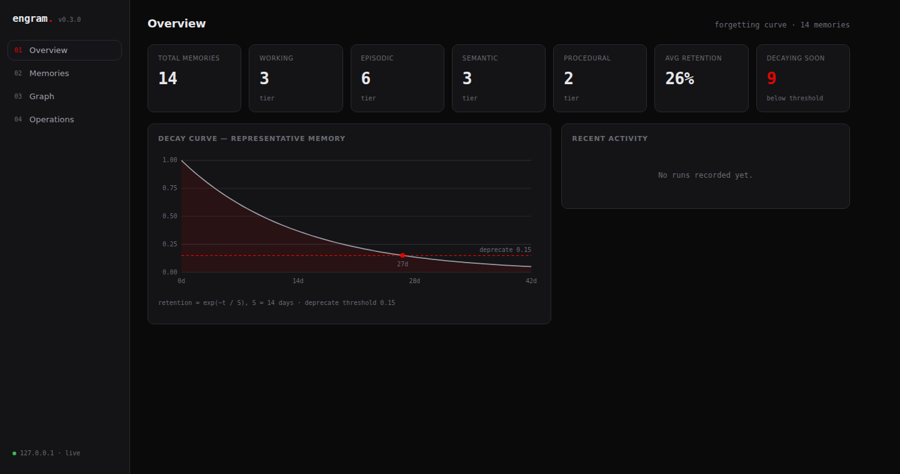

# Engram

[](https://github.com/blakestone-x/engram/actions/workflows/ci.yml)
[](./LICENSE)
[](https://nodejs.org)

Local-first, markdown-native memory for AI agents. Memories are plain `.md` files with YAML frontmatter that decay on a forgetting curve, get reinforced when recalled, and consolidate from raw experience into durable knowledge.

## What it is

An agent's memory lives in a folder you own. Each memory is one markdown file. A small TypeScript engine reads those files and adds the three things a folder of notes cannot do on its own:

- A **shape** — four cognitive tiers (`working → episodic → semantic → procedural`).
- A **metabolism** — memories lose retention over time unless they are referenced, and unreferenced low-value ones are auto-deprecated.
- A **consolidation pass** — aged, reinforced episodic memories cluster by similarity and promote into semantic memories.

The markdown is the source of truth. The search index and any vectors are derived and rebuildable. Delete `.engram/` and you lose speed, not data.

Any MCP-capable agent — Claude Desktop, Claude Code, Cursor — can use a vault as live memory through the bundled [MCP server](#plug-it-into-an-agent-mcp): recall relevant memory before acting, write new memory after learning something, reinforce what worked. No vector database to run.

## Why

Most agents are built one of two ways. Either they start every session blank, or they dump everything into a vector store that grows without bound and never forgets — so a stale fact from three months ago ranks next to one written this morning, and retrieval quality erodes as the store fills.

Engram gives memory a structure and a half-life. Tiers separate scratch notes from operating rules. The decay curve means a memory you stop using fades on a predictable schedule; recalling it resets that clock and makes it more durable each time, the way spaced repetition works for people. Consolidation rolls up the episodic record into semantic summaries instead of keeping every raw observation forever.

And because the store is markdown, you can read it, `grep` it, diff it in git, and edit it by hand. There is no database to inspect through a client and no opaque binary blob.

## Quickstart

From a clone of the monorepo:

```bash
git clone https://github.com/blakestone-x/engram
cd engram
npm install
npm run build:lib        # builds @engram/core and the engram CLI
```

Run the CLI directly from the built output:

```bash
node packages/cli/dist/index.js init my-vault
```

Or install the `engram` binary globally and use it anywhere:

```bash
npm i -g ./packages/cli
engram init my-vault
cd my-vault
```

The rest of this guide assumes the `engram` binary is on your path. Every command walks up from the current directory to find the nearest vault, so once you are inside `my-vault/` you can drop the `--dir` flag.

### Initialize a vault

```bash
$ engram init my-vault
Initialized Engram vault at /home/you/my-vault
Next: engram status   ·   engram add -t "..." --tier working   ·   engram panel
```

This creates the tier directories, `.engram/config.json`, a seed "Welcome to Engram" memory, and the search index.

### Add a memory

```bash
$ engram add -t "Customer prefers email over phone" --tier episodic \
    --type observation --importance 6 --tags contact,acme \
    -b "Confirmed on the 5/30 call. Phone goes to voicemail; email gets a same-day reply."
Added 0c5f1e7a  episodic/2026-05-31-customer-prefers-email-over-phone-0c5f1e7a.md
```

Pass `-b -` to read the body from stdin. Title and tier are the only required fields; everything else is defaulted.

### Search and recall

`search` is plain BM25 over the markdown. `recall` is the agent-facing entry point — it blends the BM25 score with how well-retained and reinforced each memory is, so a durable, frequently-used memory outranks a fading one that happens to share more words.

```bash
$ engram search customer email
1.84  Customer prefers email over phone [episodic] 0c5f1e7a
     … Confirmed on the 5/30 call. Phone goes to voicemail; email gets a same-day reply. …

$ engram recall how to reach the customer
2.07  Customer prefers email over phone [episodic] 73% ×0
```

Both accept `--json` for piping into an agent. `recall` reports each hit's retention and reinforcement count (`×0` here means it has never been reinforced).

### Pack context for a prompt

`context` is recall with a token budget. It returns a compact markdown block of the most useful memories, ready to drop straight into a prompt — bounded retrieval instead of stuffing the whole store into the window.

```bash
$ engram context "how should we reach this customer" --budget 800
# Recalled memory for: how should we reach this customer

- [episodic] Customer prefers email over phone: Acme contact replies same-day to email; phone goes to voicemail. (id 0c5f1e7a)
- [semantic] Account owner is the billing contact: Route account questions to the listed owner, not support. (id 9a2b1c3d)

  2 memories · ~120 tokens
```

It fills the block in `recall` order and stops before the budget is exceeded, so a larger vault costs the same per call. This is the primitive the MCP server's `engram_context` tool wraps.

### Hybrid search (optional embeddings)

Engram is lexical-only and fully offline by default. To add semantic recall, give it an embedding key — Engram reads `OPENAI_API_KEY` from a gitignored `.env` at the vault root (it is never committed or sent anywhere else):

```bash
echo "OPENAI_API_KEY=sk-..." > .env     # at the vault root; already gitignored
engram vectors                          # embeds every memory, flips config to openai
engram search "how do we reach the customer" --hybrid
```

`engram vectors` builds `.engram/vectors.json` and sets `embeddings.provider` in your config. `search --hybrid` then fuses BM25 with embedding cosine via Reciprocal Rank Fusion, recovering paraphrase matches that lexical search misses. With no key, none of this runs and nothing leaves the machine.

### Reinforce what proved useful

```bash
$ engram reinforce 0c5f1e7a
Reinforced 0c5f1e7a  Customer prefers email over phone  → strength 1
```

Reinforcing bumps `strength`, resets the decay clock to today, and logs the event. Each reinforcement raises the memory's stability, so it decays more slowly from then on.

### Run the metabolism

```bash
$ engram decay
Evaluated 4 · forgettable 1 · dry-run (use --apply)
  9%  An old scratch note [working] a1b2c3d4

$ engram decay --apply
Evaluated 4 · forgettable 1 · deprecated 1
  9%  An old scratch note [working] a1b2c3d4
```

`decay` is a dry run by default; `--apply` sets forgettable memories to `status: deprecated` and rewrites them. Consolidation works the same way:

```bash
$ engram consolidate
Eligible 5 · clusters 1 · dry-run (use --apply)
  cluster 1: 3 sources · dispatch, routing, overflow

$ engram consolidate --apply
Eligible 5 · clusters 1 · written 1
  cluster 1: 3 sources · dispatch, routing, overflow
```

### Check status

```bash
$ engram status

  Engram · /home/you/my-vault

  working      1
  episodic     5
  semantic     2
  procedural   0

  total 8   avg retention 71%   decaying soon 1
  status: active 7  consolidated 1  deprecated 0  disputed 0

  recently reinforced
    ×1 Customer prefers email over phone 2026-05-31
```

### Open the control panel

```bash
$ engram panel

  Engram control panel
  ▸ http://127.0.0.1:4319
```

The panel is a local web UI (black/grey/red, instrument-panel aesthetic) for browsing memories, watching the decay curve, inspecting the link graph, and running the decay/consolidate/reindex passes with a dry-run preview before applying. It binds to loopback only and has no auth. A screenshot:



## Plug it into an agent (MCP)

The `@engram/mcp` package is a [Model Context Protocol](https://modelcontextprotocol.io) server. Point it at a vault and any MCP client gets five tools:

| Tool | The agent calls it to |
|------|-----------------------|
| `engram_context` | pull a token-budgeted block of relevant memory before acting |
| `engram_recall` | get ranked hits (relevance blended with retention and reinforcement) |
| `engram_remember` | write a new memory after learning something |
| `engram_reinforce` | mark a recalled memory as useful so it stays sharp |
| `engram_stats` | read vault size, per-tier counts, and what is decaying soon |

Create a vault, then add the server to your MCP config (Claude Desktop, Claude Code, Cursor, …):

```json
{
  "mcpServers": {
    "engram": {
      "command": "npx",
      "args": ["-y", "@engram/mcp", "--vault", "/absolute/path/to/agent-memory"]
    }
  }
}
```

Give the agent one instruction — *call `engram_context` before answering, `engram_remember` after learning something durable, `engram_reinforce` when a memory was right* — and it accumulates a long-term memory that decays what it stops using and consolidates what it keeps. See [packages/mcp/README.md](packages/mcp/README.md) for details.

## Key features

**Markdown is the source of truth.** Every memory is a `.md` file you can read and edit. The BM25 index in `.engram/index.json` and the optional vector index are both derived — `engram reindex` rebuilds them from the markdown alone.

**Four cognitive tiers.** `working` for scratch, `episodic` for time-stamped observations, `semantic` for durable facts and knowledge, `procedural` for operating rules. The tier is set in frontmatter, not by which folder a file sits in (`engram doctor` warns when those disagree). Tiers are fixed; types, tags, and domains are yours to configure.

**Ebbinghaus decay.** Retention follows the forgetting curve:

```
retention = exp(-t / S)
S = baseStability · (1 + strengthWeight · strength) · importanceFactor
```

where `t` is days since the memory was last reinforced (or created) and `importanceFactor(i) = 1 + importanceWeight · (i − 5)`, floored at `0.25`. Stability is also scaled per tier (`tierStability`, default working 0.4 / episodic 1 / semantic 2.5 / procedural 8), so `working` scratch fades in days while `procedural` rules are effectively permanent. With the defaults (`baseStability` 14 days, `strengthWeight` 0.8, `importanceWeight` 0.15), a neutral episodic memory loses about 63% of its retention in two weeks if you never touch it. See [docs/MEMORY-MODEL.md](docs/MEMORY-MODEL.md) for the full derivation.

**Reinforcement is spaced repetition.** Each recall you confirm useful can be reinforced; that resets the clock to today and increments `strength`, which raises future stability. Memories you keep using become progressively harder to forget. Memories you ignore fall below the deprecate threshold and get marked `deprecated`.

**Consolidation, episodic to semantic.** The offline pass gathers aged, reinforced episodic memories, clusters them by token overlap, and synthesizes one durable semantic memory per cluster — with `informed_by` links back to every source. The sources are kept and marked `consolidated`, so the trail remains. Promotion past semantic (to a procedural operating rule) is human-invoked only, via `engram promote`.

**Supersession instead of deletion.** When a fact changes, a new memory with a `supersedes` link retires the old one — marking it `deprecated` and stamping `superseded_by`, never deleting it. Superseded and expired (`valid_until`) memories drop out of recall, but the history stays on disk and is queryable with `recall --as-of <date>`. This is the lightweight, markdown-native version of a bi-temporal knowledge graph.

**BM25F search, optional embeddings.** Retrieval is a pure-TypeScript inverted index with **BM25F** field weighting — title, summary, and body each get their own length normalization and a combined document frequency (default weights title 5 / summary 2 / body 1), with optional Porter stemming so word variants match. Fully offline, no service to run. If you configure an embedding provider, `buildVectors` populates a vector index and search fuses lexical and semantic ranks with Reciprocal Rank Fusion. With no provider configured, nothing leaves the machine.

**Dedup on write.** Identical title+body reinforces the existing memory instead of writing a duplicate, so append-heavy agents don't bloat the store.

**Fast at scale.** A cached in-process store and a self-healing incremental index keep steady-state operations in the single-digit milliseconds even on a multi-thousand-memory vault (`getMemory` and `reinforce` are effectively O(1); a write reconciles one document, not the whole index).

**Control panel.** A black/grey/red web UI over the engine's local HTTP API: overview with a live decay chart, a filterable memory table, a force-directed link graph, and an operations view that previews a decay or consolidation run before you apply it.

**Privacy scrub.** Before a memory is written, its body is run through a redaction pass that replaces matches of the vault's `redactPatterns` with `[REDACTED]`. The defaults catch AWS keys, OpenAI-style secret keys, GitHub PATs, and PEM private-key headers; extend them per vault.

**Zero native dependencies in the engine.** `@engram/core` is pure TypeScript — no `better-sqlite3`, no native addons. It installs and runs on a clean machine with only Node ≥ 20. The HTTP server uses `node:http`.

## Memory file format

A memory is one markdown file. The frontmatter is serialized in a fixed key order:

```markdown
---
id: 0c5f1e7a
title: Customer prefers email over phone
tier: episodic
type: observation
status: active
confidence: medium
importance: 6
strength: 1
created: 2026-05-31
last_reviewed: 2026-05-31
last_reinforced: 2026-05-31
tags:
  - contact
  - acme
links:
  - to: 9a2b1c3d
    rel: related
summary: Acme contact replies same-day to email; phone goes to voicemail.
---

Confirmed on the 5/30 call. Phone goes to voicemail; email gets a same-day reply.
```

Only `title` and `tier` are required on write — the rest are defaulted. The `last_reinforced` date is the decay clock; reinforcing resets it. Hand-edit any field and the engine will load it; a missing field falls back to its default rather than erroring.

## How it fits an agent loop

Engram is a CLI and a library, so it slots into whatever orchestration you already have. A typical loop:

1. **Recall before acting.** Pull the most useful memories for the current task. `engram context "<task context>" --budget 1500` returns a prompt-ready block; `engram recall "<task context>" --json` returns ranked hits weighted by retention and reinforcement. Through MCP this is the `engram_context` tool.
2. **Write observations as you go.** New facts and events go to `working` or `episodic`: `engram add -t "..." --tier episodic --type observation -b -`.
3. **Reinforce what paid off.** When a recalled memory turned out to be the right one, `engram reinforce <id>` so it stays durable.
4. **Schedule the metabolism.** Run the offline passes on a cron — `engram decay --apply` and `engram consolidate --apply` nightly, say — so the store forgets dead weight and rolls episodic experience up into semantic knowledge without you in the loop.

`engram doctor` exits non-zero on integrity errors (broken links, duplicate ids, out-of-range importance), so you can run it as a CI gate on a vault checked into git.

## Architecture at a glance

Four packages in an npm workspace:

- **`@engram/core`** — the engine. A cached vault store, frontmatter, the BM25F index, decay, consolidation, recall, context packing, the optional embedding layer, and a `node:http` API. No native dependencies.
- **`engram`** — the CLI. A thin, scriptable surface over core; plain-text output by default, `--json` where it helps.
- **`@engram/mcp`** — the Model Context Protocol server. Exposes the vault as five memory tools to any MCP client.
- **`@engram/panel`** — the Vite + React control panel, built to a static bundle that core can serve.

See [docs/ARCHITECTURE.md](docs/ARCHITECTURE.md) for the module map and data flow.

## Config

`.engram/config.json` holds the decay and consolidation tunables. The defaults:

```json
{
  "types": ["note", "fact", "decision", "error", "reference", "observation"],
  "decay": {
    "baseStability": 14,
    "strengthWeight": 0.8,
    "importanceWeight": 0.15,
    "deprecateThreshold": 0.15,
    "pinThreshold": 8,
    "tierStability": { "working": 0.4, "episodic": 1, "semantic": 2.5, "procedural": 8 }
  },
  "consolidation": {
    "minStrength": 2,
    "minAgeDays": 14,
    "clusterThreshold": 0.18,
    "minClusterSize": 3,
    "maxPerRun": 3
  },
  "search": { "k1": 1.5, "b": 0.75, "fieldWeights": { "title": 5, "summary": 2, "body": 1 }, "stemming": true },
  "embeddings": { "provider": null },
  "redactPatterns": ["AKIA[0-9A-Z]{16}", "sk-[A-Za-z0-9]{20,}", "ghp_[A-Za-z0-9]{36}", "-----BEGIN [A-Z ]*PRIVATE KEY-----"]
}
```

`pinThreshold` 8 means any memory with `importance >= 8` is reported but never auto-deprecated. `deprecateThreshold` 0.15 is the retention floor below which an unpinned active memory becomes forgettable. `tierStability` scales each tier's half-life. `search.fieldWeights` set the BM25F title/summary/body weighting and `search.stemming` toggles Porter stemming. Consolidation only considers episodic memories that are active, have `strength >= 2`, and are at least 14 days old. Missing keys merge over these defaults, so a partial config is fine.

## Status and roadmap

v0.2, honest about its scope: single-user, local, no cloud sync, no auth, no telemetry, no network calls unless you explicitly configure an embedding provider. It is a tool one developer points at a folder and trusts.

Settled and working: the tiered model with tier-aware decay, the decay and reinforcement math, consolidation, supersession/bi-temporal validity, BM25F search and recall, content-hash dedup, the cached store and incremental index, the CLI, the MCP server, the control-panel API, and the privacy scrub. The embedding layer ships with an OpenAI provider stub and is off by default. [docs/PRIOR-ART.md](docs/PRIOR-ART.md) explains the design choices against the wider field, with citations and a fair share of skepticism about what memory actually buys you.

Not yet: multi-user/namespaced vaults, sync, a hosted service, automatic `semantic → procedural` promotion (kept human-gated on purpose), and an optional WASM ANN backend for very large vaults.

## License

MIT. See [LICENSE](./LICENSE).

## Docs

- [docs/MEMORY-MODEL.md](docs/MEMORY-MODEL.md) — the cognitive model and the decay math, with worked examples.
- [docs/PRIOR-ART.md](docs/PRIOR-ART.md) — how Engram compares to the agent-memory field, with citations and design rationale.
- [docs/HISTORY.md](docs/HISTORY.md) — how Engram came to be.
- [docs/ARCHITECTURE.md](docs/ARCHITECTURE.md) — the module map for contributors.
